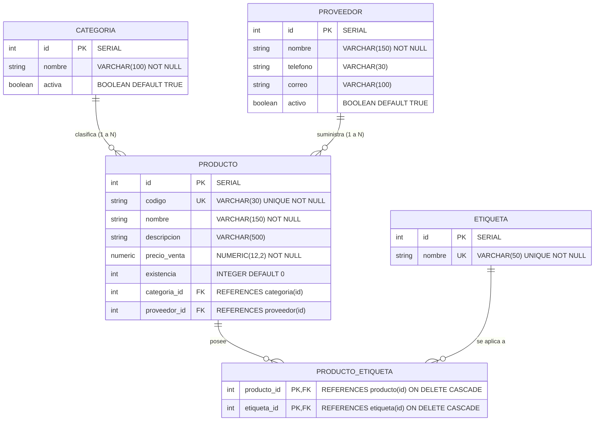

# Laboratorio #1: Implementación de Persistencia con Spring Data JPA, Modelos, Migraciones y Relaciones
## Práctica Guiada # 2 - Evolución de Arquitectura y Relaciones Muchos a Muchos

**Asignatura:** Servicios Web  
**Unidad:** Unidad II. Desarrollo de Servicios Web con Spring Boot  
**Carrera:** Ingeniería en Sistemas de Información  
**Institución:** Universidad Americana (UAM)  
**Proyecto Base:** `gestion-productos`  
**Estudiante:** Javier Espinoza  

---

## 1. Verificación del Cumplimiento de Requerimientos

| Requerimiento de la Guía | Estado | Componente Implementado |
|---|---|---|
| **Estructura en capas (controller, service, repository, entity, dto)** | ✅ Cumple | Paquetes modulares y desacoplados |
| **Paso 2: Crear ProductoService** | ✅ Cumple | `service/ProductoService.java` con `@Transactional` |
| **Paso 3: Refactorizar ProductoController** | ✅ Cumple | `controller/ProductoController.java` inyecta `ProductoService` |
| **Paso 4: Crear ProductoRequestDTO** | ✅ Cumple | `dto/ProductoRequestDTO.java` con validaciones Jakarta Bean Validation |
| **Paso 5: Registrar productos con DTO** | ✅ Cumple | `POST /api/productos` recibe `ProductoRequestDTO` y retorna 201 Created |
| **Paso 6: Actualización de productos (PUT)** | ✅ Cumple | `PUT /api/productos/{id}` actualiza campos, categoría, proveedor y etiquetas |
| **Paso 7: Eliminación de productos (DELETE)** | ✅ Cumple | `DELETE /api/productos/{id}` elimina entidad y retorna 204 No Content |
| **Paso 8: Relación 1:N Bidireccional** | ✅ Cumple | `Categoria` tiene `@OneToMany` hacia `Producto` con `@JsonIgnore` para prevenir recursión |
| **Paso 9: Consultar productos por categoría** | ✅ Cumple | `GET /api/productos/categoria/{categoriaId}` |
| **Paso 10: Migración para Etiqueta (V4)** | ✅ Cumple | `V4__crear_etiquetas.sql` creando `etiqueta` y `producto_etiqueta` |
| **Paso 11: Entidad y repositorio Etiqueta** | ✅ Cumple | `entity/Etiqueta.java` y `repository/EtiquetaRepository.java` |
| **Paso 12: Relacionar Producto y Etiqueta** | ✅ Cumple | `@ManyToMany` con `@JoinTable(name = "producto_etiqueta")` |
| **Paso 13: Crear etiquetas** | ✅ Cumple | `controller/EtiquetaController.java` (`POST /api/etiquetas`) |
| **Paso 14: Asociar etiquetas a un producto** | ✅ Cumple | `POST /api/productos/{productoId}/etiquetas/{etiquetaId}` |
| **Reto 1: Eliminar asociación Producto-Etiqueta** | ✅ Cumple | `DELETE /api/productos/{productoId}/etiquetas/{etiquetaId}` |
| **Reto 2: Consultar productos por etiqueta** | ✅ Cumple | `GET /api/productos/etiqueta/{etiquetaId}` |
| **Comprobación de aprendizaje (12 preguntas)** | ✅ Cumple | Respondidas en la sección 7 |

---

## 2. Arquitectura del Proyecto y Estructura de Paquetes

```text
gestion-productos/
├── pom.xml
├── mvnw / mvnw.cmd
├── src/
│   ├── main/
│   │   ├── java/ni/edu/uam/gestion_productos/
│   │   │   ├── GestionProductosApplication.java
│   │   │   ├── controller/
│   │   │   │   ├── CategoriaController.java
│   │   │   │   ├── ProductoController.java
│   │   │   │   ├── ProveedorController.java
│   │   │   │   ├── EtiquetaController.java
│   │   │   │   └── GlobalExceptionHandler.java
│   │   │   ├── service/
│   │   │   │   ├── ProductoService.java
│   │   │   │   └── EtiquetaService.java
│   │   │   ├── dto/
│   │   │   │   └── ProductoRequestDTO.java
│   │   │   ├── entity/
│   │   │   │   ├── Categoria.java
│   │   │   │   ├── Producto.java
│   │   │   │   ├── Proveedor.java
│   │   │   │   └── Etiqueta.java
│   │   │   └── repository/
│   │   │       ├── CategoriaRepository.java
│   │   │       ├── ProductoRepository.java
│   │   │       ├── ProveedorRepository.java
│   │   │       └── EtiquetaRepository.java
│   │   └── resources/
│   │       ├── application.properties
│   │       └── db/migration/
│   │           ├── V1__crear_tablas.sql
│   │           ├── V2__agregar_descripcion_producto.sql
│   │           ├── V3__crear_tabla_proveedor_y_relacion.sql
│   │           └── V4__crear_etiquetas.sql
│   └── test/java/ni/edu/uam/gestion_productos/
│       └── GestionProductosApplicationTests.java
```

---

## 3. Diagrama Entidad-Relación



---

## 4. Scripts de Migración Flyway (V1, V2, V3 y V4)

### `V4__crear_etiquetas.sql` (Paso 10)
```sql
CREATE TABLE etiqueta (
    id SERIAL PRIMARY KEY,
    nombre VARCHAR(50) NOT NULL UNIQUE
);

CREATE TABLE producto_etiqueta (
    producto_id INTEGER NOT NULL,
    etiqueta_id INTEGER NOT NULL,
    PRIMARY KEY (producto_id, etiqueta_id),
    CONSTRAINT fk_pe_producto
        FOREIGN KEY (producto_id)
        REFERENCES producto(id)
        ON DELETE CASCADE,
    CONSTRAINT fk_pe_etiqueta
        FOREIGN KEY (etiqueta_id)
        REFERENCES etiqueta(id)
        ON DELETE CASCADE
);
```

---

## 5. Implementación de Código Clave

### 5.1 `ProductoRequestDTO.java`
```java
package ni.edu.uam.gestion_productos.dto;

import jakarta.validation.constraints.DecimalMin;
import jakarta.validation.constraints.Min;
import jakarta.validation.constraints.NotBlank;
import jakarta.validation.constraints.NotNull;
import java.math.BigDecimal;
import java.util.Set;

public class ProductoRequestDTO {

    @NotBlank(message = "El código es obligatorio")
    private String codigo;

    @NotBlank(message = "El nombre es obligatorio")
    private String nombre;

    private String descripcion;

    @NotNull(message = "El ID de categoría es obligatorio")
    private Integer categoriaId;

    private Integer proveedorId;

    @NotNull(message = "El precio de venta es obligatorio")
    @DecimalMin(value = "0.0", inclusive = false, message = "El precio debe ser mayor a 0")
    private BigDecimal precioVenta;

    @Min(value = 0, message = "La existencia no puede ser negativa")
    private int existencia;

    private Set<Integer> etiquetasIds;

    // Constructores, Getters y Setters
}
```

### 5.2 `ProductoService.java`
```java
@Service
public class ProductoService {

    private final ProductoRepository productoRepository;
    private final CategoriaRepository categoriaRepository;
    private final ProveedorRepository proveedorRepository;
    private final EtiquetaRepository etiquetaRepository;

    public ProductoService(ProductoRepository productoRepository,
                           CategoriaRepository categoriaRepository,
                           ProveedorRepository proveedorRepository,
                           EtiquetaRepository etiquetaRepository) {
        this.productoRepository = productoRepository;
        this.categoriaRepository = categoriaRepository;
        this.proveedorRepository = proveedorRepository;
        this.etiquetaRepository = etiquetaRepository;
    }

    @Transactional(readOnly = true)
    public List<Producto> listarTodos() {
        return productoRepository.findAll();
    }

    @Transactional(readOnly = true)
    public Producto obtenerPorId(Integer id) {
        return productoRepository.findById(id)
                .orElseThrow(() -> new NoSuchElementException("Producto no encontrado con ID: " + id));
    }

    @Transactional
    public Producto crear(ProductoRequestDTO dto) {
        Categoria categoria = categoriaRepository.findById(dto.getCategoriaId())
                .orElseThrow(() -> new NoSuchElementException("Categoría no encontrada con ID: " + dto.getCategoriaId()));

        Proveedor proveedor = null;
        if (dto.getProveedorId() != null) {
            proveedor = proveedorRepository.findById(dto.getProveedorId())
                    .orElseThrow(() -> new NoSuchElementException("Proveedor no encontrado con ID: " + dto.getProveedorId()));
        }

        Producto producto = new Producto();
        producto.setCodigo(dto.getCodigo());
        producto.setNombre(dto.getNombre());
        producto.setDescripcion(dto.getDescripcion());
        producto.setCategoria(categoria);
        producto.setProveedor(proveedor);
        producto.setPrecioVenta(dto.getPrecioVenta());
        producto.setExistencia(dto.getExistencia());

        if (dto.getEtiquetasIds() != null && !dto.getEtiquetasIds().isEmpty()) {
            Set<Etiqueta> etiquetas = new HashSet<>(etiquetaRepository.findAllById(dto.getEtiquetasIds()));
            producto.setEtiquetas(etiquetas);
        }

        return productoRepository.save(producto);
    }

    @Transactional
    public Producto actualizar(Integer id, ProductoRequestDTO dto) {
        Producto producto = obtenerPorId(id);

        Categoria categoria = categoriaRepository.findById(dto.getCategoriaId())
                .orElseThrow(() -> new NoSuchElementException("Categoría no encontrada con ID: " + dto.getCategoriaId()));

        Proveedor proveedor = null;
        if (dto.getProveedorId() != null) {
            proveedor = proveedorRepository.findById(dto.getProveedorId())
                    .orElseThrow(() -> new NoSuchElementException("Proveedor no encontrado con ID: " + dto.getProveedorId()));
        }

        producto.setCodigo(dto.getCodigo());
        producto.setNombre(dto.getNombre());
        producto.setDescripcion(dto.getDescripcion());
        producto.setCategoria(categoria);
        producto.setProveedor(proveedor);
        producto.setPrecioVenta(dto.getPrecioVenta());
        producto.setExistencia(dto.getExistencia());

        if (dto.getEtiquetasIds() != null) {
            Set<Etiqueta> etiquetas = new HashSet<>(etiquetaRepository.findAllById(dto.getEtiquetasIds()));
            producto.setEtiquetas(etiquetas);
        }

        return productoRepository.save(producto);
    }

    @Transactional
    public void eliminar(Integer id) {
        Producto producto = obtenerPorId(id);
        productoRepository.delete(producto);
    }

    @Transactional(readOnly = true)
    public List<Producto> listarPorCategoria(Integer categoriaId) {
        if (!categoriaRepository.existsById(categoriaId)) {
            throw new NoSuchElementException("Categoría no encontrada con ID: " + categoriaId);
        }
        return productoRepository.findByCategoriaId(categoriaId);
    }

    @Transactional
    public Producto asociarEtiqueta(Integer productoId, Integer etiquetaId) {
        Producto producto = obtenerPorId(productoId);
        Etiqueta etiqueta = etiquetaRepository.findById(etiquetaId)
                .orElseThrow(() -> new NoSuchElementException("Etiqueta no encontrada con ID: " + etiquetaId));

        producto.agregarEtiqueta(etiqueta);
        return productoRepository.save(producto);
    }

    @Transactional
    public Producto desasociarEtiqueta(Integer productoId, Integer etiquetaId) {
        Producto producto = obtenerPorId(productoId);
        Etiqueta etiqueta = etiquetaRepository.findById(etiquetaId)
                .orElseThrow(() -> new NoSuchElementException("Etiqueta no encontrada con ID: " + etiquetaId));

        producto.eliminarEtiqueta(etiqueta);
        return productoRepository.save(producto);
    }

    @Transactional(readOnly = true)
    public List<Producto> listarPorEtiqueta(Integer etiquetaId) {
        if (!etiquetaRepository.existsById(etiquetaId)) {
            throw new NoSuchElementException("Etiqueta no encontrada con ID: " + etiquetaId);
        }
        return productoRepository.findByEtiquetasId(etiquetaId);
    }
}
```

### 5.3 `ProductoController.java`
```java
@RestController
@RequestMapping("/api/productos")
public class ProductoController {

    private final ProductoService productoService;

    public ProductoController(ProductoService productoService) {
        this.productoService = productoService;
    }

    @GetMapping
    public ResponseEntity<List<Producto>> listar() {
        return ResponseEntity.ok(productoService.listarTodos());
    }

    @GetMapping("/{id}")
    public ResponseEntity<Producto> obtenerPorId(@PathVariable Integer id) {
        return ResponseEntity.ok(productoService.obtenerPorId(id));
    }

    @PostMapping
    public ResponseEntity<Producto> crear(@Valid @RequestBody ProductoRequestDTO dto) {
        Producto creado = productoService.crear(dto);
        return ResponseEntity.status(HttpStatus.CREATED).body(creado);
    }

    @PutMapping("/{id}")
    public ResponseEntity<Producto> actualizar(@PathVariable Integer id, @Valid @RequestBody ProductoRequestDTO dto) {
        return ResponseEntity.ok(productoService.actualizar(id, dto));
    }

    @DeleteMapping("/{id}")
    public ResponseEntity<Void> eliminar(@PathVariable Integer id) {
        productoService.eliminar(id);
        return ResponseEntity.noContent().build();
    }

    @GetMapping("/categoria/{categoriaId}")
    public ResponseEntity<List<Producto>> listarPorCategoria(@PathVariable Integer categoriaId) {
        return ResponseEntity.ok(productoService.listarPorCategoria(categoriaId));
    }

    @PostMapping("/{productoId}/etiquetas/{etiquetaId}")
    public ResponseEntity<Producto> asociarEtiqueta(@PathVariable Integer productoId, @PathVariable Integer etiquetaId) {
        return ResponseEntity.ok(productoService.asociarEtiqueta(productoId, etiquetaId));
    }

    @DeleteMapping("/{productoId}/etiquetas/{etiquetaId}")
    public ResponseEntity<Producto> desasociarEtiqueta(@PathVariable Integer productoId, @PathVariable Integer etiquetaId) {
        return ResponseEntity.ok(productoService.desasociarEtiqueta(productoId, etiquetaId));
    }

    @GetMapping("/etiqueta/{etiquetaId}")
    public ResponseEntity<List<Producto>> listarPorEtiqueta(@PathVariable Integer etiquetaId) {
        return ResponseEntity.ok(productoService.listarPorEtiqueta(etiquetaId));
    }
}
```

---

## 6. Evidencias de Ejecución y Pruebas (PostgreSQL y Postman)

### 6.1 Historial de Migraciones Flyway
```text
 installed_rank | version |           description            | type |                  script                  | success 
----------------+---------+----------------------------------+------+------------------------------------------+---------
              1 | 1       | crear tablas                     | SQL  | V1__crear_tablas.sql                     | t
              2 | 2       | agregar descripcion producto     | SQL  | V2__agregar_descripcion_producto.sql     | t
              3 | 3       | crear tabla proveedor y relacion | SQL  | V3__crear_tabla_proveedor_y_relacion.sql | t
              4 | 4       | crear etiquetas                  | SQL  | V4__crear_etiquetas.sql                  | t
(4 filas)
```

### 6.2 Evidencia en PostgreSQL de Tablas y Relaciones N:M

#### Tabla `etiqueta`:
```text
 id | nombre  
----+---------
  1 | Gamer
  2 | Oferta
  3 | Premium
(3 filas)
```

#### Tabla `producto_etiqueta`:
```text
 producto_id | etiqueta_id 
-------------+-------------
           5 |           1
           5 |           2
           5 |           3
(3 filas)
```

### 6.3 Pruebas de Endpoints en Postman / REST API

#### [POST] `/api/etiquetas` (Creación de etiquetas - Paso 13)
```json
// POST http://localhost:8080/api/etiquetas
// Body:
{ "nombre": "Gamer" }

// Response (201 Created):
{
  "id": 1,
  "nombre": "Gamer"
}
```

#### [POST] `/api/productos` (Creación con DTO - Paso 5)
- **Endpoint:** `http://localhost:8080/api/productos`
- **Request Body (ProductoRequestDTO):**
```json
{
  "codigo": "LAP-003",
  "nombre": "Laptop ASUS ROG Strix",
  "descripcion": "Laptop gamer ASUS ROG AMD Ryzen 9, RTX 4070, 32GB RAM",
  "categoriaId": 1,
  "proveedorId": 1,
  "precioVenta": 1450.00,
  "existencia": 5,
  "etiquetasIds": [1, 3]
}
```
- **Response (201 Created):**
```json
{
  "id": 5,
  "codigo": "LAP-003",
  "nombre": "Laptop ASUS ROG Strix",
  "descripcion": "Laptop gamer ASUS ROG AMD Ryzen 9, RTX 4070, 32GB RAM",
  "categoria": {
    "id": 1,
    "nombre": "Computadoras",
    "activa": true
  },
  "proveedor": {
    "id": 1,
    "nombre": "Dell Latinoamérica",
    "telefono": "+505 2278-9000",
    "correo": "ventas@dell.com",
    "activo": true
  },
  "precioVenta": 1450.00,
  "existencia": 5,
  "etiquetas": [
    { "id": 1, "nombre": "Gamer" },
    { "id": 3, "nombre": "Premium" }
  ]
}
```

#### [PUT] `/api/productos/5` (Actualización - Paso 6)
- **Request Body:**
```json
{
  "codigo": "LAP-003",
  "nombre": "Laptop ASUS ROG Strix (Actualizada)",
  "descripcion": "Laptop gamer ASUS ROG AMD Ryzen 9, RTX 4070, 32GB RAM - En Oferta",
  "categoriaId": 1,
  "proveedorId": 1,
  "precioVenta": 1399.99,
  "existencia": 4,
  "etiquetasIds": [1, 2, 3]
}
```
- **Response (200 OK):** Actualización reflejada en la BD.

#### [GET] `/api/productos/categoria/1` (Productos por Categoría - Paso 9)
- **Response (200 OK):** Lista de todos los productos pertenecientes a la categoría 1 ("Computadoras").

#### [POST] `/api/productos/2/etiquetas/1` (Asociar etiqueta - Paso 14)
- Asocia la etiqueta 1 (`Gamer`) al producto 2 (`Monitor Dell 27 4K`).
- **Response (200 OK):** Producto 2 con su set de etiquetas actualizado.

#### [DELETE] `/api/productos/2/etiquetas/1` (Reto 1: Eliminar asociación)
- **Resultado:** Elimina la tupla `(2, 1)` de `producto_etiqueta` sin borrar el Producto 2 ni la Etiqueta 1.
- **Verificación posterior:** `GET /api/etiquetas/1` responde `200 OK` demostrando que la entidad `Etiqueta` permanece intacta.

#### [GET] `/api/productos/etiqueta/1` (Reto 2: Consultar productos por etiqueta)
- **Endpoint:** `http://localhost:8080/api/productos/etiqueta/1`
- **Response (200 OK):**
```json
[
  {
    "id": 5,
    "codigo": "LAP-003",
    "nombre": "Laptop ASUS ROG Strix (Actualizada)",
    "categoria": { "id": 1, "nombre": "Computadoras" },
    "etiquetas": [
      { "id": 1, "nombre": "Gamer" },
      { "id": 2, "nombre": "Oferta" },
      { "id": 3, "nombre": "Premium" }
    ]
  }
]
```

#### [DELETE] `/api/productos/{id}` (Eliminación de producto - Paso 7)
- **Response:** `204 No Content`.
- Si se vuelve a consultar el ID eliminado: `404 Not Found`.

---

## 7. Comprobación de Aprendizaje (Cuestionario de 12 Preguntas)

### 1. ¿Cuál es la función de una clase Service?
**Respuesta:**  
La clase `Service` encapsula la **lógica de negocio**, la orquestación de operaciones y la gestión de transacciones (`@Transactional`). Actúa como puente intermedio entre la capa web (`Controller`) y la capa de acceso a datos (`Repository`), garantizando que las reglas de negocio, validaciones complejas y la coordinación de múltiples repositorios no se mezclen con el protocolo HTTP ni con la persistencia directa.

### 2. ¿Por qué un controlador no debería contener toda la lógica de negocio?
**Respuesta:**  
Por el principio de **Responsabilidad Única (SRP)** y separación de intereses (*Separation of Concerns*). Si un controlador maneja la lógica de negocio:
- Se acopla la lógica al protocolo HTTP (dificultando reutilizarla en tareas en segundo plano, colas de mensajería o CLI).
- Se complica el mantenimiento y las pruebas unitarias (requerirían simular el entorno web completo).
- Genera clases "Dios" difíciles de leer y propensas a errores.  
El controlador únicamente debe recibir la petición, validar el formato de entrada, delegar al servicio y formular la respuesta HTTP.

### 3. ¿Qué es un DTO?
**Respuesta:**  
Un **DTO (Data Transfer Object)** es un objeto plano (POJO) diseñado específicamente para transportar datos entre procesos o capas de una aplicación (por ejemplo, entre el cliente HTTP y el servidor) sin transportar lógica de negocio.

### 4. ¿Qué diferencia existe entre un DTO y una entidad JPA?
**Respuesta:**  
- **Entidad JPA:** Representa el modelo relacional de la base de datos, está anotada con `@Entity`, tiene ciclo de vida gestionado por el `EntityManager`, y cualquier cambio en sus propiedades dentro de una transacción puede sincronizarse automáticamente en la base de datos (*dirty checking*).
- **DTO:** Es un contenedor simple de datos desacoplado de la persistencia. Permite filtrar campos sensibles (como contraseñas o datos internos), optimizar el payload de la red y aplicar validaciones específicas a la petición del usuario.

### 5. ¿Qué ventaja tiene recibir `categoriaId` en lugar de una entidad `Categoria` completa?
**Respuesta:**  
- **Seguridad e Integridad:** Evita ataques de asignación masiva (*Mass Assignment*), impidiendo que un cliente malicioso modifique inadvertidamente propiedades de la categoría al enviar un producto.
- **Simplicidad para el Cliente:** El cliente HTTP solo necesita enviar un número entero (`"categoriaId": 1`) en lugar de construir un objeto JSON complejo anidado.
- **Control en el Servidor:** Permite al `ProductoService` validar si la categoría realmente existe en la base de datos mediante `findById(categoriaId)` antes de intentar asociarla.

### 6. ¿Qué relación representan `@OneToMany` y `@ManyToOne`?
**Respuesta:**  
Representan una relación de multiplicidad de uno a muchos vista desde lados opuestos:
- `@OneToMany`: Vista desde el lado "Uno" (ej. una `Categoria` posee muchos `Producto`).
- `@ManyToOne`: Vista desde el lado "Muchos" (ej. muchos `Producto` pertenecen a una sola `Categoria`).  
Es la relación bidireccional clásica donde `@ManyToOne` es el lado propietario que contiene la clave foránea.

### 7. ¿Dónde se almacena la clave foránea en la relación Categoria-Producto?
**Respuesta:**  
Se almacena físicamente en la tabla del lado "Muchos", es decir, en la tabla **`producto`**, en la columna definida por `@JoinColumn(name = "categoria_id")`.

### 8. ¿Qué representa `@ManyToMany`?
**Respuesta:**  
Representa una relación de multiplicidad de "Muchos a Muchos", donde un registro de una entidad puede estar asociado con múltiples registros de otra entidad y viceversa. En este proyecto: un `Producto` puede tener múltiples `Etiqueta`s (ej. "Gamer", "Oferta"), y una `Etiqueta` puede aplicarse a múltiples `Producto`s.

### 9. ¿Cuál es la función de `@JoinTable`?
**Respuesta:**  
Especifica la configuración de la **tabla intermedia (o tabla de unión)** que materializa físicamente la relación `@ManyToMany` en un motor relacional. Define:
- `name`: Nombre de la tabla intermedia (`producto_etiqueta`).
- `joinColumns`: Clave foránea que referencia a la entidad propietaria (`producto_id`).
- `inverseJoinColumns`: Clave foránea que referencia a la entidad inversa (`etiqueta_id`).

### 10. ¿Por qué se necesita la tabla `producto_etiqueta`?
**Respuesta:**  
Porque las bases de datos relacionales no admiten de forma normalizada almacenar colecciones o listas dentro de una sola celda. Para representar una relación de muchos a muchos sin violar la Primera Forma Normal (1FN), es obligatorio utilizar una tabla puente intermedia compuesta por las claves primarias de ambas tablas (`producto_id` y `etiqueta_id`), convirtiendo la relación N:M en dos relaciones 1:N.

### 11. ¿Qué responsabilidad corresponde al Repository?
**Respuesta:**  
El `Repository` es responsable exclusivo del **acceso a datos y persistencia**. Encapsula las operaciones de consulta, inserción, actualización y eliminación contra el motor relacional mediante interfaces como `JpaRepository`, traduciendo las peticiones del servicio en comandos SQL ejecutados por Hibernate.

### 12. Explique el flujo: Cliente → Controller → Service → Repository → PostgreSQL.
**Respuesta:**  
1. **Cliente:** Envía una solicitud HTTP (ej. `POST /api/productos` con un JSON en el cuerpo).
2. **Controller:** Recibe la petición, deserializa y valida el `ProductoRequestDTO` mediante Bean Validation (`@Valid`). Si es válido, invoca el método correspondiente del `ProductoService`.
3. **Service:** Ejecuta las reglas de negocio (verifica que la categoría y el proveedor existan, aplica la lógica de etiquetas) e interactúa con el `ProductoRepository`.
4. **Repository:** Spring Data JPA e Hibernate traducen la entidad Java y sus relaciones en sentencias SQL nativas (`INSERT INTO producto...`).
5. **PostgreSQL:** El motor de base de datos ejecuta el SQL, verifica restricciones de integridad y foreign keys, y persiste el registro en el almacenamiento.
6. **Retorno:** El flujo regresa en sentido inverso, transformando la entidad guardada en una respuesta HTTP (`201 Created`) con el JSON resultante hacia el cliente.

---

## 8. Conclusión

La realización de esta práctica consolidó la arquitectura en capas estándar de la industria (Controller, Service, Repository, DTO y Entity), garantizando una estricta separación de responsabilidades y facilitando el mantenimiento y escalabilidad del software. Asimismo, el uso de DTOs permitió blindar la API frente a entradas no controladas, mientras que Flyway administró de forma limpia la evolución del esquema hacia relaciones Muchos a Muchos mediante tablas intermedias. Finalmente, la resolución de los retos finales comprobó la capacidad de manipular asociaciones relacionales complejas sin afectar la integridad del catálogo de productos y etiquetas.
