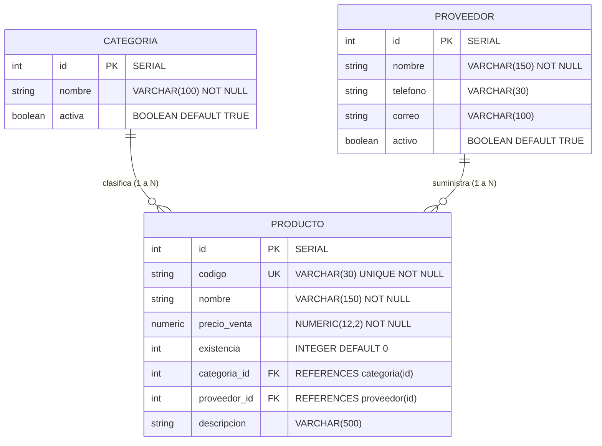

# Práctica Guiada: Persistencia y Relaciones con Spring Data JPA

**Asignatura:** Servicios Web  
**Unidad:** Unidad II. Desarrollo de Servicios Web con SpringBoot  
**Carrera:** Ingeniería en Sistemas de Información  
**Institución:** Universidad Americana (UAM)  
**Proyecto:** `gestion-productos`  
**Base de Datos:** PostgreSQL 18  

---

## 1. Configuración de la Conexión

### 1.1 Dependencias del Proyecto (`pom.xml`)
Se configuró el proyecto Maven con Java 21 y Spring Boot 3.4.4, incluyendo los starters esenciales para desarrollo web, persistencia relacional con JPA, controlador JDBC de PostgreSQL, validación y soporte de migraciones automáticas con Flyway:

```xml
<?xml version="1.0" encoding="UTF-8"?>
<project xmlns="http://maven.apache.org/POM/4.0.0" xmlns:xsi="http://www.w3.org/2001/XMLSchema-instance"
         xsi:schemaLocation="http://maven.apache.org/POM/4.0.0 https://maven.apache.org/xsd/maven-4.0.0.xsd">
    <modelVersion>4.0.0</modelVersion>
    <parent>
        <groupId>org.springframework.boot</groupId>
        <artifactId>spring-boot-starter-parent</artifactId>
        <version>3.4.4</version>
        <relativePath/>
    </parent>
    <groupId>ni.edu.uam</groupId>
    <artifactId>gestion-productos</artifactId>
    <version>0.0.1-SNAPSHOT</version>
    <name>gestion-productos</name>
    <description>Practica guiada - Persistencia y relaciones con Spring Data JPA</description>

    <properties>
        <java.version>21</java.version>
    </properties>

    <dependencies>
        <dependency>
            <groupId>org.springframework.boot</groupId>
            <artifactId>spring-boot-starter-web</artifactId>
        </dependency>
        <dependency>
            <groupId>org.springframework.boot</groupId>
            <artifactId>spring-boot-starter-data-jpa</artifactId>
        </dependency>
        <dependency>
            <groupId>org.springframework.boot</groupId>
            <artifactId>spring-boot-starter-validation</artifactId>
        </dependency>
        <dependency>
            <groupId>org.postgresql</groupId>
            <artifactId>postgresql</artifactId>
            <scope>runtime</scope>
        </dependency>
        <dependency>
            <groupId>org.flywaydb</groupId>
            <artifactId>flyway-core</artifactId>
        </dependency>
        <dependency>
            <groupId>org.flywaydb</groupId>
            <artifactId>flyway-database-postgresql</artifactId>
        </dependency>
        <dependency>
            <groupId>org.springframework.boot</groupId>
            <artifactId>spring-boot-starter-test</artifactId>
            <scope>test</scope>
        </dependency>
    </dependencies>

    <build>
        <plugins>
            <plugin>
                <groupId>org.springframework.boot</groupId>
                <artifactId>spring-boot-maven-plugin</artifactId>
            </plugin>
        </plugins>
    </build>
</project>
```

### 1.2 Archivo de Propiedades (`src/main/resources/application.properties`)
Se configuró la conexión a PostgreSQL con el usuario `postgres`, asignando a Hibernate la directiva `ddl-auto=validate` para garantizar que la creación y modificación estructural sea responsabilidad exclusiva de Flyway, mientras Hibernate únicamente valida la coherencia entre el modelo Java y el esquema físico:

```properties
spring.application.name=gestion-productos

spring.datasource.url=jdbc:postgresql://localhost:5432/gestion_productos
spring.datasource.username=postgres
spring.datasource.password=postgres

spring.jpa.hibernate.ddl-auto=validate
spring.jpa.show-sql=true
spring.jpa.properties.hibernate.format_sql=true

spring.flyway.enabled=true
```

---

## 2. Estructura de Paquetes

El proyecto sigue una arquitectura en capas limpia y desacoplada dentro del paquete base `ni.edu.uam.gestion_productos`:

```text
gestion-productos/
├── pom.xml
├── mvnw
├── mvnw.cmd
├── .mvn/
│   └── wrapper/
│       ├── maven-wrapper.jar
│       └── maven-wrapper.properties
└── src/
    ├── main/
    │   ├── java/
    │   │   └── ni/
    │   │       └── edu/
    │   │           └── uam/
    │   │               └── gestion_productos/
    │   │                   ├── GestionProductosApplication.java
    │   │                   ├── controller/
    │   │                   │   ├── CategoriaController.java
    │   │                   │   ├── ProductoController.java
    │   │                   │   └── ProveedorController.java
    │   │                   ├── entity/
    │   │                   │   ├── Categoria.java
    │   │                   │   ├── Producto.java
    │   │                   │   └── Proveedor.java
    │   │                   └── repository/
    │   │                       ├── CategoriaRepository.java
    │   │                       ├── ProductoRepository.java
    │   │                       └── ProveedorRepository.java
    │   └── resources/
    │       ├── application.properties
    │       └── db/
    │           └── migration/
    │               ├── V1__crear_tablas.sql
    │               ├── V2__agregar_descripcion_producto.sql
    │               └── V3__crear_tabla_proveedor_y_relacion.sql
    └── test/
        └── java/
            └── ni/
                └── edu/
                    └── uam/
                        └── gestion_productos/
                            └── GestionProductosApplicationTests.java
```

---

## 3. Entidades Desarrolladas

### 3.1 Entidad `Categoria` (`Categoria.java`)
Representa la clasificación del catálogo comercial:
```java
package ni.edu.uam.gestion_productos.entity;

import jakarta.persistence.*;

@Entity
@Table(name = "categoria")
public class Categoria {

    @Id
    @GeneratedValue(strategy = GenerationType.IDENTITY)
    private Integer id;

    private String nombre;

    private boolean activa;

    public Categoria() {
    }

    public Categoria(Integer id, String nombre, boolean activa) {
        this.id = id;
        this.nombre = nombre;
        this.activa = activa;
    }

    public Integer getId() {
        return id;
    }

    public void setId(Integer id) {
        this.id = id;
    }

    public String getNombre() {
        return nombre;
    }

    public void setNombre(String nombre) {
        this.nombre = nombre;
    }

    public boolean isActiva() {
        return activa;
    }

    public void setActiva(boolean activa) {
        this.activa = activa;
    }
}
```

### 3.2 Entidad `Proveedor` (`Proveedor.java`) - Reto Final
Representa al suministrador de productos:
```java
package ni.edu.uam.gestion_productos.entity;

import jakarta.persistence.*;

@Entity
@Table(name = "proveedor")
public class Proveedor {

    @Id
    @GeneratedValue(strategy = GenerationType.IDENTITY)
    private Integer id;

    @Column(nullable = false, length = 150)
    private String nombre;

    @Column(length = 30)
    private String telefono;

    @Column(length = 100)
    private String correo;

    private boolean activo = true;

    public Proveedor() {
    }

    public Proveedor(Integer id, String nombre, String telefono, String correo, boolean activo) {
        this.id = id;
        this.nombre = nombre;
        this.telefono = telefono;
        this.correo = correo;
        this.activo = activo;
    }

    public Integer getId() {
        return id;
    }

    public void setId(Integer id) {
        this.id = id;
    }

    public String getNombre() {
        return nombre;
    }

    public void setNombre(String nombre) {
        this.nombre = nombre;
    }

    public String getTelefono() {
        return telefono;
    }

    public void setTelefono(String telefono) {
        this.telefono = telefono;
    }

    public String getCorreo() {
        return correo;
    }

    public void setCorreo(String correo) {
        this.correo = correo;
    }

    public boolean isActivo() {
        return activo;
    }

    public void setActivo(boolean activo) {
        this.activo = activo;
    }
}
```

### 3.3 Entidad `Producto` (`Producto.java`)
Contiene las relaciones `@ManyToOne` hacia `Categoria` y hacia `Proveedor`:
```java
package ni.edu.uam.gestion_productos.entity;

import jakarta.persistence.*;
import java.math.BigDecimal;

@Entity
@Table(name = "producto")
public class Producto {

    @Id
    @GeneratedValue(strategy = GenerationType.IDENTITY)
    private Integer id;

    private String codigo;

    private String nombre;

    private String descripcion;

    @ManyToOne
    @JoinColumn(name = "categoria_id")
    private Categoria categoria;

    @ManyToOne
    @JoinColumn(name = "proveedor_id")
    private Proveedor proveedor;

    @Column(name = "precio_venta")
    private BigDecimal precioVenta;

    private int existencia;

    public Producto() {
    }

    public Producto(Integer id, String codigo, String nombre, String descripcion, Categoria categoria, Proveedor proveedor, BigDecimal precioVenta, int existencia) {
        this.id = id;
        this.codigo = codigo;
        this.nombre = nombre;
        this.descripcion = descripcion;
        this.categoria = categoria;
        this.proveedor = proveedor;
        this.precioVenta = precioVenta;
        this.existencia = existencia;
    }

    public Integer getId() {
        return id;
    }

    public void setId(Integer id) {
        this.id = id;
    }

    public String getCodigo() {
        return codigo;
    }

    public void setCodigo(String codigo) {
        this.codigo = codigo;
    }

    public String getNombre() {
        return nombre;
    }

    public void setNombre(String nombre) {
        this.nombre = nombre;
    }

    public String getDescripcion() {
        return descripcion;
    }

    public void setDescripcion(String descripcion) {
        this.descripcion = descripcion;
    }

    public Categoria getCategoria() {
        return categoria;
    }

    public void setCategoria(Categoria categoria) {
        this.categoria = categoria;
    }

    public Proveedor getProveedor() {
        return proveedor;
    }

    public void setProveedor(Proveedor proveedor) {
        this.proveedor = proveedor;
    }

    public BigDecimal getPrecioVenta() {
        return precioVenta;
    }

    public void setPrecioVenta(BigDecimal precioVenta) {
        this.precioVenta = precioVenta;
    }

    public int getExistencia() {
        return existencia;
    }

    public void setExistencia(int existencia) {
        this.existencia = existencia;
    }
}
```

---

## 4. Diagrama de Relaciones



---

## 5. Scripts de Migración Flyway

### 5.1 Script `V1__crear_tablas.sql`
```sql
CREATE TABLE categoria (
    id SERIAL PRIMARY KEY,
    nombre VARCHAR(100) NOT NULL,
    activa BOOLEAN NOT NULL DEFAULT TRUE
);

CREATE TABLE producto (
    id SERIAL PRIMARY KEY,
    codigo VARCHAR(30) NOT NULL UNIQUE,
    nombre VARCHAR(150) NOT NULL,
    precio_venta NUMERIC(12,2) NOT NULL,
    existencia INTEGER NOT NULL DEFAULT 0,
    categoria_id INTEGER NOT NULL,

    CONSTRAINT fk_producto_categoria
        FOREIGN KEY (categoria_id)
        REFERENCES categoria(id)
);
```

### 5.2 Script `V2__agregar_descripcion_producto.sql`
```sql
ALTER TABLE producto
ADD COLUMN descripcion VARCHAR(500);
```

### 5.3 Script `V3__crear_tabla_proveedor_y_relacion.sql` (Reto Final)
```sql
CREATE TABLE proveedor (
    id SERIAL PRIMARY KEY,
    nombre VARCHAR(150) NOT NULL,
    telefono VARCHAR(30),
    correo VARCHAR(100),
    activo BOOLEAN NOT NULL DEFAULT TRUE
);

ALTER TABLE producto
ADD COLUMN proveedor_id INTEGER,
ADD CONSTRAINT fk_producto_proveedor
    FOREIGN KEY (proveedor_id)
    REFERENCES proveedor(id);
```

---

## 6. Evidencia de PostgreSQL

### 6.1 Historial de Migraciones Flyway (`flyway_schema_history`)
Consulta ejecutada en PostgreSQL:
```sql
SELECT installed_rank, version, description, type, script, success FROM flyway_schema_history ORDER BY installed_rank;
```
Resultado obtenido:
```text
 installed_rank | version |           description            | type |                  script                  | success 
----------------+---------+----------------------------------+------+------------------------------------------+---------
              1 | 1       | crear tablas                     | SQL  | V1__crear_tablas.sql                     | t
              2 | 2       | agregar descripcion producto     | SQL  | V2__agregar_descripcion_producto.sql     | t
              3 | 3       | crear tabla proveedor y relacion | SQL  | V3__crear_tabla_proveedor_y_relacion.sql | t
(3 filas)
```

### 6.2 Tablas Creadas en el Esquema `public`
```text
                 Listado de tablas
 Esquema |        Nombre         | Tipo  |   Dueño    
---------+-----------------------+-------+----------
 public  | categoria             | tabla | postgres
 public  | flyway_schema_history | tabla | postgres
 public  | producto              | tabla | postgres
 public  | proveedor             | tabla | postgres
(4 filas)
```

### 6.3 Datos en Tablas de la Base de Datos

#### Tabla `categoria`:
```text
 id |    nombre    | activa 
----+--------------+--------
  1 | Computadoras | t
  2 | Accesorios   | t
  3 | Monitores    | t
(3 filas)
```

#### Tabla `proveedor`:
```text
 id |        nombre        |    telefono    |       correo        | activo 
----+----------------------+----------------+---------------------+--------
  1 | Dell Latinoamérica   | +505 2278-9000 | ventas@dell.com     | t
  2 | Lenovo Centroamérica | +505 2255-4433 | contacto@lenovo.com | t
(2 filas)
```

#### Tabla `producto`:
```text
 id | codigo  |         nombre         | precio_venta | existencia | categoria_id | proveedor_id |                       descripcion                        
----+---------+------------------------+--------------+------------+--------------+--------------+----------------------------------------------------------
  1 | LAP-001 | Laptop Lenovo          |       850.00 |         10 |            1 |              | Laptop Lenovo IdeaPad 15 pulgadas, 16GB RAM, 512GB SSD
  2 | MON-001 | Monitor Dell 27 4K     |       420.50 |         15 |            3 |            1 | Monitor Dell UltraSharp 27 pulgadas IPS 4K UHD
  3 | LAP-002 | ThinkPad E14           |       980.00 |          8 |            1 |            2 | Laptop empresarial Lenovo ThinkPad E14 Gen 5 AMD Ryzen 7
  4 | ACC-001 | Mouse Inalambrico Dell |        35.00 |         50 |            2 |            1 | Mouse optico inalambrico Dell Premier WM527
(4 filas)
```

---

## 7. Pruebas de Endpoints (Postman / HTTP API)

### 7.1 Categorías

#### [GET] `/api/categorias` (Consulta Inicial - Base vacía)
- **Status:** `200 OK`
- **Response:**
```json
[]
```

#### [POST] `/api/categorias` (Creación de Categorías)
**Request 1:**
- **Endpoint:** `http://localhost:8080/api/categorias`
- **Body:**
```json
{
  "nombre": "Computadoras",
  "activa": true
}
```
- **Response:** `200 OK`
```json
{
  "id": 1,
  "nombre": "Computadoras",
  "activa": true
}
```

**Request 2:**
```json
{
  "nombre": "Accesorios",
  "activa": true
}
```
- **Response:** `200 OK` `{"id": 2, "nombre": "Accesorios", "activa": true}`

**Request 3:**
```json
{
  "nombre": "Monitores",
  "activa": true
}
```
- **Response:** `200 OK` `{"id": 3, "nombre": "Monitores", "activa": true}`

#### [GET] `/api/categorias` (Consulta Posterior)
- **Response:** `200 OK`
```json
[
  {
    "id": 1,
    "nombre": "Computadoras",
    "activa": true
  },
  {
    "id": 2,
    "nombre": "Accesorios",
    "activa": true
  },
  {
    "id": 3,
    "nombre": "Monitores",
    "activa": true
  }
]
```

---

### 7.2 Proveedores (Reto Final)

#### [POST] `/api/proveedores` (Proveedor 1)
- **Endpoint:** `http://localhost:8080/api/proveedores`
- **Body:**
```json
{
  "nombre": "Dell Latinoamérica",
  "telefono": "+505 2278-9000",
  "correo": "ventas@dell.com",
  "activo": true
}
```
- **Response:** `200 OK`
```json
{
  "id": 1,
  "nombre": "Dell Latinoamérica",
  "telefono": "+505 2278-9000",
  "correo": "ventas@dell.com",
  "activo": true
}
```

#### [POST] `/api/proveedores` (Proveedor 2)
- **Endpoint:** `http://localhost:8080/api/proveedores`
- **Body:**
```json
{
  "nombre": "Lenovo Centroamérica",
  "telefono": "+505 2255-4433",
  "correo": "contacto@lenovo.com",
  "activo": true
}
```
- **Response:** `200 OK`
```json
{
  "id": 2,
  "nombre": "Lenovo Centroamérica",
  "telefono": "+505 2255-4433",
  "correo": "contacto@lenovo.com",
  "activo": true
}
```

#### [GET] `/api/proveedores`
- **Response:** `200 OK`
```json
[
  {
    "id": 1,
    "nombre": "Dell Latinoamérica",
    "telefono": "+505 2278-9000",
    "correo": "ventas@dell.com",
    "activo": true
  },
  {
    "id": 2,
    "nombre": "Lenovo Centroamérica",
    "telefono": "+505 2255-4433",
    "correo": "contacto@lenovo.com",
    "activo": true
  }
]
```

---

### 7.3 Productos con Relaciones (`@ManyToOne`)

#### [POST] `/api/productos` (Creación con Llaves Foráneas Asociadas)
**Producto 1 (Laptop Lenovo relacionada a Categoría 1):**
```json
{
  "codigo": "LAP-001",
  "nombre": "Laptop Lenovo",
  "descripcion": "Laptop Lenovo IdeaPad 15 pulgadas, 16GB RAM, 512GB SSD",
  "categoria": {
    "id": 1
  },
  "precioVenta": 850.00,
  "existencia": 10
}
```

**Producto 2 (Monitor Dell relacionado a Categoría 3 y Proveedor 1):**
```json
{
  "codigo": "MON-001",
  "nombre": "Monitor Dell 27 4K",
  "descripcion": "Monitor Dell UltraSharp 27 pulgadas IPS 4K UHD",
  "categoria": {
    "id": 3
  },
  "proveedor": {
    "id": 1
  },
  "precioVenta": 420.50,
  "existencia": 15
}
```

**Producto 3 (ThinkPad E14 relacionado a Categoría 1 y Proveedor 2):**
```json
{
  "codigo": "LAP-002",
  "nombre": "ThinkPad E14",
  "descripcion": "Laptop empresarial Lenovo ThinkPad E14 Gen 5 AMD Ryzen 7",
  "categoria": {
    "id": 1
  },
  "proveedor": {
    "id": 2
  },
  "precioVenta": 980.00,
  "existencia": 8
}
```

**Producto 4 (Mouse Dell relacionado a Categoría 2 y Proveedor 1):**
```json
{
  "codigo": "ACC-001",
  "nombre": "Mouse Inalámbrico Dell",
  "descripcion": "Mouse óptico inalámbrico Dell Premier WM527",
  "categoria": {
    "id": 2
  },
  "proveedor": {
    "id": 1
  },
  "precioVenta": 35.00,
  "existencia": 50
}
```

#### [GET] `/api/productos` (Respuesta con Objetos Anidados)
- **Status:** `200 OK`
- **Response:**
```json
[
  {
    "id": 1,
    "codigo": "LAP-001",
    "nombre": "Laptop Lenovo",
    "descripcion": "Laptop Lenovo IdeaPad 15 pulgadas, 16GB RAM, 512GB SSD",
    "categoria": {
      "id": 1,
      "nombre": "Computadoras",
      "activa": true
    },
    "proveedor": null,
    "precioVenta": 850.00,
    "existencia": 10
  },
  {
    "id": 2,
    "codigo": "MON-001",
    "nombre": "Monitor Dell 27 4K",
    "descripcion": "Monitor Dell UltraSharp 27 pulgadas IPS 4K UHD",
    "categoria": {
      "id": 3,
      "nombre": "Monitores",
      "activa": true
    },
    "proveedor": {
      "id": 1,
      "nombre": "Dell Latinoamérica",
      "telefono": "+505 2278-9000",
      "correo": "ventas@dell.com",
      "activo": true
    },
    "precioVenta": 420.50,
    "existencia": 15
  },
  {
    "id": 3,
    "codigo": "LAP-002",
    "nombre": "ThinkPad E14",
    "descripcion": "Laptop empresarial Lenovo ThinkPad E14 Gen 5 AMD Ryzen 7",
    "categoria": {
      "id": 1,
      "nombre": "Computadoras",
      "activa": true
    },
    "proveedor": {
      "id": 2,
      "nombre": "Lenovo Centroamérica",
      "telefono": "+505 2255-4433",
      "correo": "contacto@lenovo.com",
      "activo": true
    },
    "precioVenta": 980.00,
    "existencia": 8
  },
  {
    "id": 4,
    "codigo": "ACC-001",
    "nombre": "Mouse Inalámbrico Dell",
    "descripcion": "Mouse óptico inalámbrico Dell Premier WM527",
    "categoria": {
      "id": 2,
      "nombre": "Accesorios",
      "activa": true
    },
    "proveedor": {
      "id": 1,
      "nombre": "Dell Latinoamérica",
      "telefono": "+505 2278-9000",
      "correo": "ventas@dell.com",
      "activo": true
    },
    "precioVenta": 35.00,
    "existencia": 50
  }
]
```

---

## 8. Comprobación de Aprendizaje (Preguntas y Respuestas)

### 1. ¿Cuál es la función de Spring Data JPA?
**Respuesta:**  
La función principal de Spring Data JPA es simplificar drásticamente la capa de acceso a datos en aplicaciones Spring. Actúa como una capa de abstracción sobre los proveedores JPA (como Hibernate), eliminando el código repetitivo (*boilerplate*) necesario para implementar operaciones CRUD, paginación, ordenamiento y consultas derivadas por convención de nombres de métodos (`findBy...`), sin necesidad de implementar manualmente clases DAO ni manejar transacciones a bajo nivel.

### 2. ¿Qué función cumple Hibernate?
**Respuesta:**  
Hibernate es el motor ORM (*Object-Relational Mapping*) y la implementación concreta de la especificación JPA utilizada por defecto en Spring Boot. Su función es traducir las clases y objetos Java en tablas y registros de base de datos relacional y viceversa. Hibernate se encarga de generar el código SQL nativo para el motor configurado (PostgreSQL), gestionar la sesión de persistencia, administrar el ciclo de vida de las entidades, gestionar la caché de primer nivel y validar la correspondencia del esquema.

### 3. ¿Qué diferencia existe entre JPA e Hibernate?
**Respuesta:**  
- **JPA (Jakarta Persistence API):** Es una **especificación estándar** de Java (un conjunto de interfaces, anotaciones y reglas) que define cómo debe operar el mapeo objeto-relacional. No contiene código ejecutable por sí sola.
- **Hibernate:** Es una **implementación concreta** (el *framework* real que contiene el código ejecutable) que implementa la especificación JPA y añade funciones adicionales propietarias (como filtros avanzados, caché distribuida de segundo nivel y generadores de ID especializados).

### 4. ¿Qué función cumple `@Entity`?
**Respuesta:**  
La anotación `@Entity` le indica a JPA e Hibernate que la clase Java representa una tabla en la base de datos relacional y que sus instancias serán gestionadas por el contexto de persistencia (*EntityManager*). Permite que el ORM mapee los atributos de la clase con las columnas de la tabla correspondiente.

### 5. ¿Qué función cumple `@ManyToOne`?
**Respuesta:**  
Define una relación de multiplicidad de "muchos a uno" entre dos entidades. En este caso de estudio, indica que múltiples registros de `Producto` pertenecen a una única `Categoria` (y a un único `Proveedor`). Establece la clave foránea en la tabla propietaria de la relación (`producto`).

### 6. ¿Qué función cumple `@JoinColumn`?
**Respuesta:**  
Especifica el nombre físico y las características de la columna que actúa como clave foránea (*foreign key*) en la tabla de la base de datos relacional. En `@JoinColumn(name = "categoria_id")`, le indica a Hibernate que la columna en la tabla `producto` que almacena la referencia hacia la clave primaria de `categoria` se llama exactamente `categoria_id`.

### 7. ¿Qué función cumple `JpaRepository`?
**Respuesta:**  
`JpaRepository<T, ID>` es una interfaz provista por Spring Data JPA que proporciona métodos prefabricados para interactuar con la base de datos:
- `findAll()`: Recupera todos los registros de la entidad.
- `findById(ID id)`: Busca un registro por su clave primaria.
- `save(T entity)`: Inserta un nuevo registro o actualiza uno existente.
- `deleteById(ID id)`: Elimina un registro por clave primaria.
- `existsById(ID id)`: Comprueba la existencia de un registro.
- `count()`: Cuenta la cantidad total de registros.  
Además incorpora soporte para paginación (`PagingAndSortingRepository`) y operaciones por lotes (`batch flush`).

### 8. ¿Por qué se utilizan migraciones?
**Respuesta:**  
Las herramientas de migración como **Flyway** proporcionan control de versiones evolutivo y determinista para la estructura de la base de datos relacional. Evitan la discrepancia entre ambientes (desarrollo, pruebas, producción), garantizan que los cambios en las tablas se ejecuten de manera secuencial y automatizada, previenen la pérdida accidental de datos producida por modos destructivos como `ddl-auto=create-drop`, y mantienen una bitácora inmutable en la tabla `flyway_schema_history`.

### 9. ¿Qué diferencia existe entre V1, V2 y V3?
**Respuesta:**  
- **`V1__crear_tablas.sql`:** Establece el esquema base inicial, creando la tabla `categoria` y la tabla `producto` con su restricción de clave foránea `fk_producto_categoria`.
- **`V2__agregar_descripcion_producto.sql`:** Aplica una modificación incremental al producto existente, añadiendo la columna `descripcion VARCHAR(500)`.
- **`V3__crear_tabla_proveedor_y_relacion.sql`:** Desarrolla el reto final de la práctica al incorporar la nueva entidad `proveedor` y alterar la tabla `producto` para añadir la columna `proveedor_id` con su clave foránea `fk_producto_proveedor`.

### 10. ¿Qué problema puede producir una relación bidireccional al generar JSON?
**Respuesta:**  
Una relación bidireccional no controlada provoca un error de **recursión infinita (`StackOverflowError`)** durante la serialización con Jackson (el motor JSON de Spring Boot). Esto ocurre cuando `Categoria` tiene una lista de `Producto` y cada `Producto` referencia a su `Categoria`, provocando un ciclo sin fin (`Categoria -> Producto -> Categoria -> Producto ...`). Para solucionarlo, se diseñan las relaciones de manera unidireccional (como se implementó en esta práctica), o se emplean anotaciones como `@JsonManagedReference` / `@JsonBackReference`, `@JsonIgnore`, o el uso de DTOs (*Data Transfer Objects*).

---

## 9. Análisis de la Configuración `spring.jpa.hibernate.ddl-auto=validate`

La propiedad `spring.jpa.hibernate.ddl-auto=validate` cumple la función crítica de verificar en el arranque de la aplicación que las entidades Java coincidan con el esquema existente en PostgreSQL, **sin intentar crear, alterar o borrar tablas**. Si existe alguna discrepancia (por ejemplo, falta una columna o el tipo de dato es incompatible), Spring Boot aborta el inicio con una excepción. Esto asegura que el esquema esté estrictamente gobernado por los scripts de migración de Flyway, aplicando las mejores prácticas de la industria para entornos corporativos y de producción.

---

## 10. Conclusión

El desarrollo de esta práctica permitió comprender de manera integral la persistencia relacional empresarial mediante Spring Boot, Spring Data JPA y PostgreSQL. Se evidenció cómo Flyway garantiza un control de versiones robusto sobre la base de datos relacional al ejecutar migraciones estructuradas (V1, V2 y V3), mientras que Hibernate con `ddl-auto=validate` asegura la integridad del modelo sin alterar manualmente el esquema físico. Asimismo, la implementación de relaciones `@ManyToOne` entre Producto, Categoría y Proveedor demostró la facilidad con la que Spring Data JPA y REST Controllers gestionan y serializan estructuras de datos relacionadas hacia los clientes HTTP.
